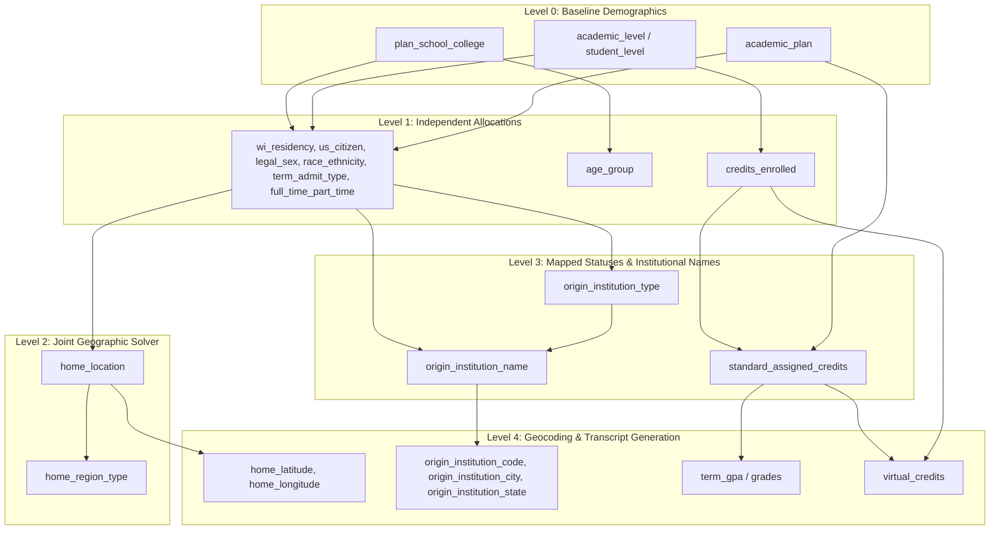

## Population Synthesis Dependency Tree

The generation algorithm is structured as a parallel branching dependency tree. Variables are allocated sequentially, with downstream variables depending on their direct ancestors. Geographic location and course grades are optimized jointly using marginal-balanced solvers.

---

## Cohesive Step & Feature Breakdown

**Level 0: Baseline Demographics**
* `student_id`: unique numeric primary key.
* `plan_school_college`: independent baseline input from registrar.
* `academic_plan`: independent baseline input from registrar.
* `student_level`: independent baseline input from registrar.
* `academic_level`: independent baseline input from registrar.
* `school_abbr`: clean school abbreviation derived from `plan_school_college`.
* `level_class`: tier classification derived from `student_level`.

**Level 1: Independent Allocations**
* `wi_residency`: allocated stochastically per plan matching `plan_residency.csv`.
* `us_citizen`: allocated stochastically per plan matching `plan_citizenship.csv`.
* `legal_sex`: allocated stochastically per plan matching `plan_legalSex.csv`.
* `race_ethnicity`: allocated stochastically per plan matching `plan_race.csv`.
* `term_admit_type`: allocated stochastically per plan matching `plan_termAdmitType.csv`.
* `full_time_part_time`: allocated stochastically per plan matching `plan_fullTimePartTime.csv`.
* `age_group`: allocated stochastically per school matching `school_age.csv`.
* `credits_enrolled`: allocated stochastically per level matching `credits_academicLevel.csv`.

**Level 2: Joint Geographic Solver**
* `home_location`: allocated per academic level using a greedy compatibility matching solver constrained by joint residency and admit type distributions.
* `home_region_type`: determined deterministically from `home_location` (WI County, US State, or International country).
* `origin_institution_type`: determined deterministically from `term_admit_type`.

**Level 3: Institutional Name Allocation**
* `origin_institution_name`: allocated stochastically per admit type and gender matching school lists.

**Level 4: Geocoding & Transcript Generation**
* `home_latitude`: coordinate centroid mapped from `home_location`.
* `home_longitude`: coordinate centroid mapped from `home_location`.
* `origin_institution_code`: CEEB code mapped from `origin_institution_name`.
* `origin_institution_city`: school city mapped from `origin_institution_name`.
* `origin_institution_state`: school state mapped from `origin_institution_name`.
* `standard_assigned_credits`: sum of credits assigned in matched standard sections in Step 5.
* `virtual_credits`: buffer credits remaining to reach `credits_enrolled`.
* `course_transcript`: list of course enrollments and grades (grades assigned conditionally based on the target GPA class).
* `term_gpa`: average of standard course grades mapped to GPA points.
* `cumulative_gpa`: set identical to `term_gpa` for the term.

---

## Key Observations

*   **Virtual Seats Necessity**: Virtual enrollments act as a buffer because standard section capacities from the registrar report do not match the total student credit demand.
*   **GPA Distribution Calibration**: Grade assignment in sections is conditionally sorted based on target GPAs from `gpa_parsed.csv` to preserve realistic grade differences across cohorts.

