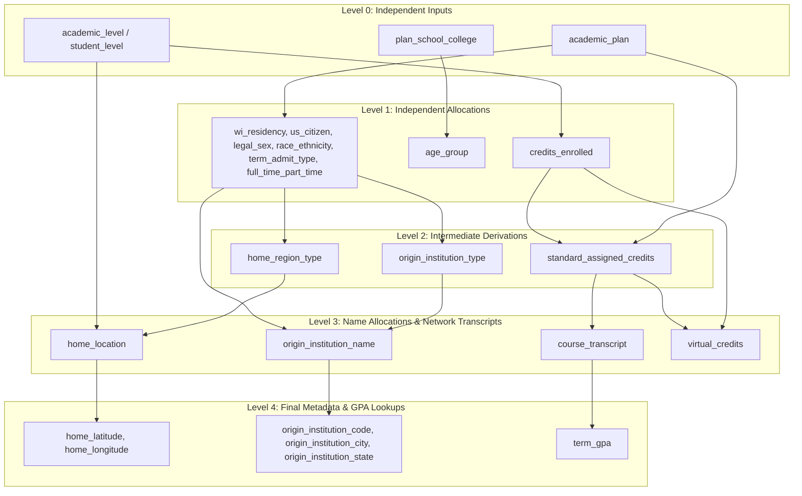

# ALGO.md

## Population Synthesis Dependency Tree

The generation algorithm is structured as a parallel branching dependency tree. Features in sibling branches are generated completely independently, while children inside a branch depend strictly on their direct ancestors.

---

## Cohesive Step & Feature Breakdown

**Level 0**
* `plan_school_college`: independent input
* `academic_plan`: independent input
* `student_level`: independent input
* `academic_level`: independent input

**Level 1**
* `wi_residency`: dependent on `academic_plan`
* `us_citizen`: dependent on `academic_plan`
* `legal_sex`: dependent on `academic_plan`
* `race_ethnicity`: dependent on `academic_plan`
* `term_admit_type`: dependent on `academic_plan`
* `full_time_part_time`: dependent on `academic_plan`
* `age_group`: dependent on `plan_school_college`
* `credits_enrolled`: dependent on `academic_level`

**Level 2**
* `home_region_type`: dependent on `wi_residency`, `us_citizen`
* `origin_institution_type`: dependent on `term_admit_type`
* `standard_assigned_credits`: dependent on `credits_enrolled`, `academic_plan`

**Level 3**
* `home_location`: dependent on `home_region_type`, `academic_level`
* `origin_institution_name`: dependent on `origin_institution_type`, `legal_sex`
* `course_transcript`: dependent on `academic_plan`, `standard_assigned_credits`
* `virtual_credits`: dependent on `credits_enrolled`, `standard_assigned_credits`

**Level 4**
* `home_latitude`: dependent on `home_location`
* `home_longitude`: dependent on `home_location`
* `origin_institution_code`: dependent on `origin_institution_name`
* `origin_institution_city`: dependent on `origin_institution_name`
* `origin_institution_state`: dependent on `origin_institution_name`
* `term_gpa`: dependent on `course_transcript`

---

## Key Observations

* **Cumulative GPA Exclusion**: `cumulative_gpa` is excluded from the simulation because the model focuses strictly on the Fall 2025–2026 term.
* **Virtual Seats Necessity**: Virtual enrollments act as a buffer because standard section capacities from the registrar report do not match the total student credit demand.
* **Transcript Stochasticity**: Grade assignment is stochastic because the raw data only contains section-level grade distributions with no individual student-course grade mappings.
