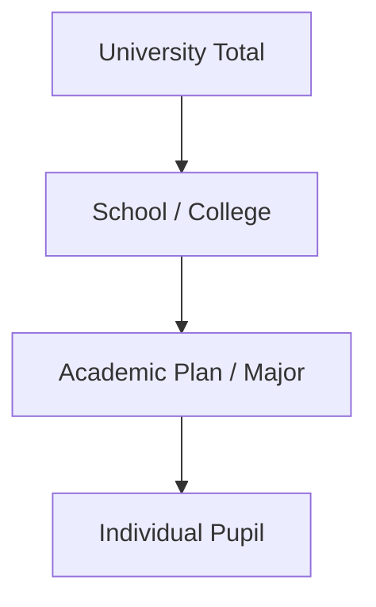

# Product Requirements Document: Virtual UW-Madison Campus

## 1. Product Overview & Goal

The end product is a **Virtual UW-Madison Campus**: an interactive, static web application that simulates a complete student-course network of 51,822 unique pupils based on real Fall 2025–2026 registrar data.

> For implementation simplicity and to preserve 100% headcount fidelity at the academic plan level, students with multiple plans (double majors/certificates) are instantiated as separate pupil units. This raises the active database size in the final implementation to **74,780** synthetic pupils.

---

## 2. Traversal Trajectory (Academic Path Only)

The application supports a **single traversal trajectory** from the macro university level down to a specific pupil. No other hierarchical traversal paths exist in the navigation tree.

### Hierarchy Rules:
1. **University Level**: Aggregated metrics across all pupils.
2. **School/College Level**: Aggregated metrics across all plans in that division.
3. **Academic Plan (Major) Level**: Aggregated metrics for pupils enrolled in that plan.
4. **Pupil Level**: The ultimate unit carrying all features.

---

## 3. Synthetic Pupil Profile Schema (All Available Features)

Every pupil profile carries the complete set of features extracted from the registrar datasets. The profile schema contains:

### A. Identification
1. `student_id`: Unique numeric identifier.

### B. Academic Trajectory
2. `student_level`: General tier (`Undergraduate`, `Graduate`, `Special (Non-Degree)`, or `Clinical Doctorate`).
3. `academic_level`: Precise standing (`Freshman`, `Sophomore`, `Junior`, `Senior`, `Masters`, `PhD`, `University`, `College`, `Guest Senior`, or `Guest Student`).
4. `plan_school_college`: Hosting school (e.g., `Letters & Science`, `Business`, `Engineering`).
5. `academic_plan`: Comma-separated list of plans (supporting double majors/certificates).
6. `credits_enrolled`: Enrolled credit hours for the term.
7. `term_gpa`: Dynamically calculated Term GPA.

### C. Core Demographics
8. `legal_sex`: Gender (`Male`, `Female`, or `Undisclosed`).
9. `race_ethnicity`: Racial classification (`White`, `Asian`, `Black/African American`, `Hispanic/Latino`, `Intl.`, etc.).
10. `us_citizen`: U.S. citizenship (`Citizen`, `Non-Citizen`, or `Unknown`).
11. `wi_residency`: Wisconsin tuition residency (`Resident` or `Non-Resident`).
12. `age_group`: Age category (`Under 18`, `18 to 21`, `22 to 29`, `30 to 39`, or `40 or Older`).
13. `term_admit_type`: Admission type (`Continuing`, `First Time Undergraduate`, `First Time Graduate`, `Transfer`, etc.).
14. `full_time_part_time`: Intensity (`Full Time` or `Part Time`).

### D. Geographic Origin
15. `home_region_type`: Region classification (`WI County`, `US State`, or `International`).
16. `home_location`: The specific Wisconsin County name, US State name, or Home Country name.
17. `home_latitude`: Latitude coordinate of the home location.
18. `home_longitude`: Longitude coordinate of the home location.

### E. Prior Institution
19. `origin_institution_type`: Institution type (`High School`, `Transfer College`, or `N/A`).
20. `origin_institution_name`: School/college name.
21. `origin_institution_code`: High school CEEB code (if applicable).
22. `origin_institution_city`: City of high school (if applicable).
23. `origin_institution_state`: State of high school (if applicable).

### F. Matching & Derived Features
24. `standard_assigned_credits`: Credits assigned in standard sections.
25. `virtual_credits`: Balance of credit hours absorbed by the virtual buffer.
26. `school_abbr`: Clean school abbreviation (e.g., `L&S`, `BUS`).
27. `level_class`: Matching classification (`undergrad`, `grad`, `special`, or `clinical`).
28. `course_transcript`: List of course enrollments (Subject, Course Num, Section, Title, Credits, Grade).

---

## 4. Feature Fidelity & Sufficiency Levels (Validation Targets)

Fidelity levels indicate which features must match the validation reference counts with 100% accuracy vs. those that match with statistical proximity:

### A. Level 1: Perfect Fidelity (100% Accuracy Target)
These features are sufficient, consistent, and must match validation reference tables with exactly **100% accuracy** at all levels of the tree:
1. **Academic Plan counts**: Headcounts in `plan_academicLevel.csv` must match the plan-level pupil counts exactly.
2. **Legal Sex by Plan**: Legal sex counts in `plan_legalSex.csv` must match the synthesized pupil distributions for each plan exactly.
3. **Wisconsin Residency by Plan**: Residency counts in `plan_residency.csv` must match synthesized distributions for each plan exactly.
4. **U.S. Citizenship by Plan**: Citizenship counts in `plan_citizenship.csv` must match synthesized distributions for each plan exactly.
5. **Race/Ethnicity by Plan**: Race/ethnicity counts in `plan_race.csv` must match synthesized distributions for each plan exactly.
6. **Term Admit Type by Plan**: Admit type counts in `plan_termAdmitType.csv` must match synthesized distributions for each plan exactly.
7. **Full/Part-Time status by Plan**: Full-time/part-time counts in `plan_fullTimePartTime.csv` must match synthesized distributions for each plan exactly.

### B. Level 2: Aggregated Cohort Fidelity (100% Accuracy at School/Cohort Level)
These features do not have plan-by-plan joint tables in the source data, but their aggregate counts at the School or Cohort level must match validation targets with **100% accuracy**:
8. **Age Group**: Matches `school_age.csv` (by school) and `level_age.csv` (by cohort) exactly.
9. **WI County**: Wisconsin county distributions match `wisconsinCounty_academicLevel.csv` (by cohort) exactly.
10. **US State**: US state distributions match `usState_academicLevel.csv` (by cohort) exactly.
11. **Home Country**: Home country distributions match `country_academicLevel.csv` (by cohort) exactly.
12. **Prior Institutions (High School / Transfer)**: Aggregate counts of high school and transfer college assignments match `highSchoolName_legalSex.csv` and `transfer_legalSex.csv` (by cohort) exactly.

### C. Level 3: Proximity Fidelity (Statistical/Heuristic Matching)
These features represent continuous or complex networks where exact integer replication is mathematically insufficient or inconsistent, and must match targets within standard statistical deviation:
13. **Credits Enrolled**: Credit distribution matches `credits_academicLevel.csv` targets.
14. **Course Transcript Grades**: Grade distributions in sections match `grade_distribution_parsed.csv` targets.
